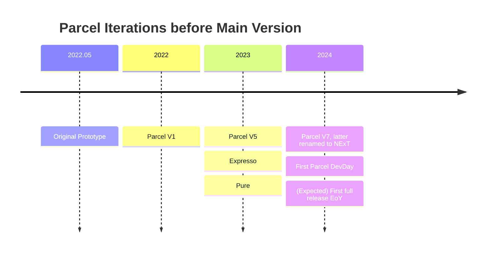

# Parcel - The Workflow Engine (Organization Overview Page)

Hi there!👋

Parcel is an advanced lightweight general-purpose functional/procedural node based visual scripting platform/workflow execution engine, along with PSL (Parcel Standard Libraries), POF (Parcel Original Frameworks), PVM (Parcel Virtual Machine) and POS (Parcel Open Stadards) specs, with built-in runtime handling and context awareness for C# and Python, and a text-based scripting DSL (Domain-Specific Language) known as MiniParcel. Here is a video demo of an [early prototype in C# implemented using WPF (2022)](https://youtu.be/yEHaf_4y5AE). It's simple enough to be used by non-programmers but also extensive enough to be used by experienced developers. The primary focus of Parcel at know is shell automation and data analytics.

Parcel is specified by a [suite of standards](https://github.com/Charles-Zhang-Parcel/Parcel_NExT/tree/main/Parcel%20Open%20Standard) and is provided as a [reference implementation](https://github.com/Charles-Zhang-Parcel/Parcel_NExT/tree/main/C%23).

Parcel is a workflow-engine designed to make office life and data analytics easier with better visualization, and with a stretch - maybe even fun! It's direct "competitors" are Microsoft Excel, MathWorks MATLAB, and Python - though different tools are designed for different things. Parcel is designed for non-programmers, but it's also intended to be as extensible as possible 😆 My intention is to create a new kind of data analytics role which I shall call "Technical Analyst", which is like in between a usual data analyst and someone who is also concerned with higher-level insights (like manager). It's a bridge between lower level implementations (e.g. in Python or C#) and higher level analytics goals.

* Inspired by Houdini and Grasshooper, as a replacement to Excel, Ipython, and Matlab - it's a graphical platform designed for interactively designing, debugging and executing workflow-based processes, enabling efficient iterations of data operations; 
* Currently working on second iteration, with full Python interoperability (through Cpython)

The key problem Parcel trying to solve is the "growth" problem of prototype analytical scripts - you will know what I mean if you've started something simple in Python, and a few months later is becomes a monster that you don't want to touch. Beginners and new programmers in Python are especially prone to this problem, because they thought Python is easy to learn, only to learn that it's not that easy to write good Python good after all.

|Repo|Description|Status|
|-|-|-|
|[Parcel V1 Prototype](https://github.com/Charles-Zhang-Parcel/Parcel_V1_Prototype)|Original functional prototype with dashboard function targeting Windows and .Net 6.|Demo Only; Active (Maintenance Only)|
|[Parcel V1](https://github.com/Charles-Zhang-Parcel/Parcel_V1)|Original prototype of Parcel without the dashboard (web server) part. This serves as functional demo of the concept. Implemented using C# in WPF.|Active (Maintenance Only); All design documents will be migrated|
|[Parcel NExT](https://github.com/Charles-Zhang-Parcel/Parcel_NExT)|Current active development of the "official" version of Parcel. Previously known as "Parcel V7".|Active (Development)|
|Prototypes|||
|[ParcelTasks](https://github.com/Charles-Zhang-Parcel/ParcelTasks)||In-migration, will eventually delete|

# Overview

Active repo: https://github.com/Charles-Zhang-Parcel/Parcel_NExT (Formerlly known as "Parcel V7")

(This software is still in-dev; When it's ready for production use I will open the private repos)

* Official Website: https://parcel.totalimagine.com
* Forum: [Github Discussion](https://github.com/Charles-Zhang-Parcel/Parcel_NExT/discussions)
* Official (End-User) Public Wiki: https://github.com/Charles-Zhang-Parcel/Parcel_NExT/tree/main/Wiki
* Itch.io Release: https://charles-zhang.itch.io/parcel
* YouTube Channel: [Charles Zhang](https://www.youtube.com/playlist?list=PLuGKdF2KHaWF6V9-eUWfelc5ZAoHCUbej) <!--In the forseeable future I will be the only one developing this, and to save management effort, I will just take all the glory and manage it under my own accounts.-->
* Telegram: [Telegram Group](https://t.me/+zFs-woUjnLVlNjUx)
* Training Series: PENDING (YouTube)
* Azure DevOps: https://dev.azure.com/ParcelEngine/Parcel

Parcel is completely free for non-commercial use and small businesses!🎉

# Parcel Developer Hub

Provides general purpose usage manual, [basic wiki](https://github.com/Charles-Zhang-Parcel/Parcel_NExT/tree/main/Wiki), general [Q&amp;A discussion](https://github.com/Charles-Zhang-Parcel/Parcel_NExT/discussions/categories/technical), and [bug](https://github.com/Charles-Zhang-Parcel/Parcel_NExT/issues)/[request firing](https://github.com/Charles-Zhang-Parcel/Parcel_NExT/discussions/categories/ideas).

This is mostly targeting developers. For end-users, use [Forum](https://github.com/Charles-Zhang-Parcel/Parcel_NExT/discussions) and [Official Wiki](https://github.com/Charles-Zhang-Parcel/Parcel_NExT/tree/main/Wiki).

Look into ~~ParcelTasks and ParcelDesignDocuments for more information~~ (migrating to Azure DevOps).

# A Note on NExT - History of Parcel🗓️

<!--

**Here are some ideas to get you started:**

🙋‍♀️ A short introduction - what is your organization all about?
🌈 Contribution guidelines - how can the community get involved?
👩‍💻 Useful resources - where can the community find your docs? Is there anything else the community should know?
🍿 Fun facts - what does your team eat for breakfast?
🧙 Remember, you can do mighty things with the power of [Markdown](https://docs.github.com/github/writing-on-github/getting-started-with-writing-and-formatting-on-github/basic-writing-and-formatting-syntax)
-->
